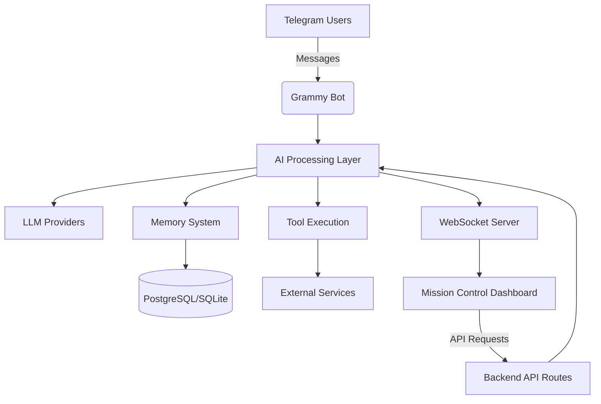

# Gravity Claw: Personal AI Agent Framework


A sophisticated, secure, and fully-understood personal AI agent system featuring a TypeScript-based backend with a modern web-based control dashboard (Mission Control).

## ✨ Key Features

### 🤖 AI Capabilities
- Integration with multiple LLM providers (OpenAI, Google Generative AI, OpenRouter, Anthropic)
- Voice synthesis via Cartesia for natural speech output
- Model Context Protocol (MCP) support for extensible tool usage
- Failover mechanisms for robust AI service continuity

### 💬 Communication
- Telegram bot integration using Grammy framework for seamless messaging
- WebSocket support for real-time bidirectional communication
- Secure authentication and session management

### 🗄️ Data Management
- PostgreSQL database integration (via Supabase) for scalable cloud storage
- SQLite local database with better-sqlite3 for offline capabilities
- Automatic task scheduling with node-cron for timed operations
- Memory management system with short-term buffer and long-term semantic storage

### 🎛️ Control Interface (Mission Control)
- Next.js 15 + React 19 dashboard with modern UI
- Real-time data visualization and analytics
- Modular architecture for easy extension
- Lucide icons for consistent, lightweight UI
- Responsive design for desktop and mobile access

### 🔧 Developer Experience
- TypeScript throughout for type safety and maintainability
- Docker and Docker Compose for consistent deployment
- Comprehensive logging and monitoring
- Extensible tool system for custom functionality
- Environment-based configuration for different deployment targets

## 🏗️ Architecture



### Core Components
1. **Bot Layer** (`src/bot.ts`) - Handles Telegram interactions via Grammy
2. **AI Service** (`src/llm/`) - Abstracted LLM provider integration with failover
3. **Memory System** (`src/memory/`) - Multi-layer memory (buffer, semantic, summary)
4. **Tool System** (`src/tools/`) - Extensible tools for AI agent capabilities
5. **Mission Control** (`mission-control/`) - Next.js dashboard for monitoring and control
6. **Configuration** (`src/config.ts`) - Centralized environment-based configuration
7. **Heartbeat** (`src/heartbeat.ts`) - System health monitoring and scheduling

## 🚀 Getting Started

### Prerequisites
- Node.js >= 18
- Docker & Docker Compose (for containerized deployment)
- Supabase account (for PostgreSQL) or local SQLite setup
- API keys for desired LLM providers (OpenAI, Google, etc.)
- Telegram Bot Token (from @BotFather)

### Installation
1. Clone the repository:
   ```bash
   git clone https://github.com/yourusername/gravity_claw.git
   cd gravity_claw
   ```

2. Install dependencies:
   ```bash
   npm install
   ```

3. Configure environment variables:
   ```bash
   cp .env.example .env
   # Edit .env with your configuration
   cp mission-control/.env.example mission-control/.env.local
   # Edit mission-control/.env.local with your configuration
   ```

4. Initialize databases:
   ```bash
   # For Supabase (PostgreSQL)
   # Set up your Supabase project and add the URL/KEY to .env
   
   # For SQLite (local development)
   # The database will be created automatically on first run
   ```

5. Start the application:
   ```bash
   # Development mode
   npm run dev
   
   # Or using Docker Compose
   docker-compose up --build
   ```

## 🛠️ Usage

### Interacting with Your AI Agent
- Start chatting with your agent via Telegram
- Use Mission Control dashboard at `http://localhost:3000` to:
  - Monitor agent activity and memory
  - Configure AI provider settings
  - Manage connected tools and services
  - View analytics and usage statistics

### Extending Functionality
1. Create new tools in `src/tools/` following the existing pattern
2. Register tools in the AI agent's tool registry
3. Access tools via natural language commands or direct API calls
4. Deploy updates via `docker-compose up --build --detach`

## 🔧 Configuration

### Environment Variables
Key configuration options in `.env`:
- `TELEGRAM_BOT_TOKEN` - Your Telegram bot token
- `OPENAI_API_KEY` - OpenAI API key (if using)
- `GOOGLE_API_KEY` - Google Generative AI API key (if using)
- `SUPABASE_URL` & `SUPABASE_KEY` - Supabase connection details
- `CARTESIA_API_KEY` - Cartesia API key for voice synthesis
- `WEBHOOK_URL` - Public URL for webhook endpoints
- `NODE_ENV` - Environment (development/production)

### Mission Control Settings
Accessible via the dashboard Settings page:
- AI provider selection and parameters
- Memory system configuration
- Tool enable/disable toggles
- Notification preferences
- Appearance and theme options

## 📦 Deployment Options

### Docker Compose (Recommended)
```yaml
# docker-compose.yml
services:
  bot:
    build: .
    ports:
      - "3001:3001"  # Bot API
      - "3000:3000"  # Mission Control
    environment:
      - NODE_ENV=production
    volumes:
      - ./data:/app/data  # Persistent storage
```

### Manual Deployment
1. Build the bot: `npm run build`
2. Start the bot: `npm start`
3. Start Mission Control: `cd mission-control && npm run start`
4. Ensure environment variables are set appropriately

## 🧩 Extending the Framework

### Adding New AI Providers
1. Create a new provider in `src/llm/providers/` extending `BaseLLMProvider`
2. Register the provider in `src/llm/factory.ts`
3. Add required API keys to environment variables
4. Select the provider via Mission Control settings

### Creating Custom Tools
1. Create a new file in `src/tools/` (e.g., `my-custom-tool.ts`)
2. Implement the tool interface with `execute()` method
3. Export the tool from `src/tools/index.ts`
4. The tool will be automatically available to the AI agent

### Memory System Customization
- Adjust memory buffer sizes in `src/memory/buffer.ts`
- Modify semantic memory embedding parameters in `src/memory/embeddings.ts`
- Configure summary generation prompts in `src/memory/summary.ts`

## 🤝 Contributing

Contributions are welcome! Please feel free to submit a Pull Request.

1. Fork the repository
2. Create your feature branch (`git checkout -b feature/AmazingFeature`)
3. Commit your changes (`git commit -m 'Add some AmazingFeature'`)
4. Push to the branch (`git push origin feature/AmazingFeature`)
5. Open a Pull Request

Please make sure to update tests as appropriate and follow the existing code style.

## 📄 License

This project is licensed under the MIT License - see the [LICENSE](LICENSE) file for details.

## 🙏 Acknowledgments

- [Grammy.js](https://grammy.dev/) for Telegram bot framework
- [Next.js](https://nextjs.org/) for the React framework
- [Supabase](https://supabase.com/) for PostgreSQL backend
- [Cartesia](https://cartesia.ai/) for voice synthesis technology
- All contributors and users of this project

---

**Gravity Claw** - Building the future of personal AI agents, one secure interaction at a time.
